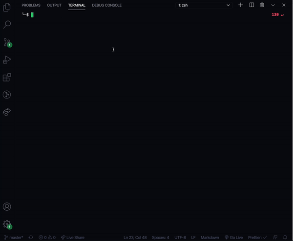

# Guess That Pokemon!

This is a word guessing game based around the first 150 pokemon from Indigo League

It was built using these dependencies

- [`inquirer`](https://www.npmjs.com/package/inquirer)
- [`chalk`](https://www.npmjs.com/package/chalk)

## Installation

1. Clone the repo to your computer
2. Run `npm -i` to install node dependencies

## Gameplay

Once you have installed the dependencies simply run `node index.js` to start playing

### Rules

1. Each turn you will be able to guess a letter from a-z
2. If you guess correctly, the letter(s) will reveal themselves
3. If you guess incorrectly, you will lose an attempt
4. You have a total of 10 attempts to guess a pokemon
5. You will not be penalized for guessing a previously attempted letter
6. When the game is over, you will be shown your final score

